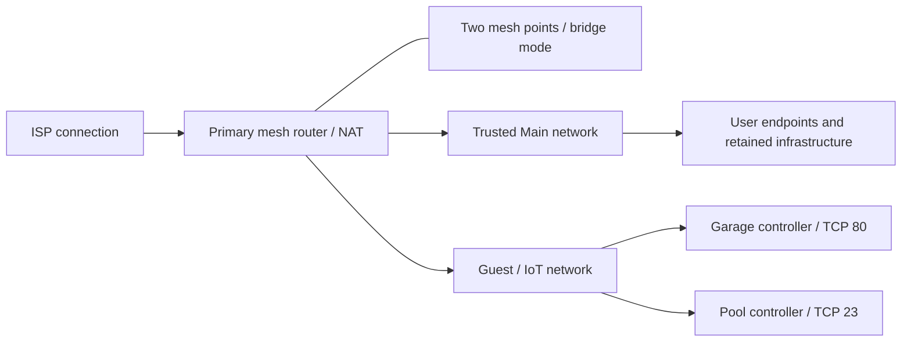

# Home Network Infrastructure & Security Hardening Lab

A home lab covering mesh deployment, configuration hardening, authorized wireless assessment, IoT segmentation, packet analysis, Splunk monitoring, and Python reporting. The project connects each change to recorded evidence and separates observed results from unverified assumptions.

## Key Results

| Main-LAN metric | Before | After |
|---|---:|---:|
| Hosts observed | 12 | 10 |
| Open TCP service records | 39 | 34 |
| Selected security-relevant service records | 5 | 1 |
| Targeted IoT controllers observed on Main | 2 | 0 |

Both selected controllers were correlated on Guest by matching MAC addresses. The service-count changes also include unrelated host/service differences; they are not vulnerability-reduction rates. [Source-data verification](documentation/python-xml-validation.md) explains the reconciliation.

## What I Built

- A three-point mesh network with a primary NAT router and two bridge-mode mesh points, managed through Google Home.
- A separate Guest/IoT network for selected household controllers, with targeted reachability validation.
- Splunk asset/service dashboards and a Windows failed-login threshold alert.
- Python automation to parse Nmap XML, export inventories, and compare network states.

Google Home recorded an Internet speed result of **975 Mbps download / 966 Mbps upload**. This is an app-reported Internet test, not a measurement of Wi-Fi performance in every room. [Deployment and hardening](documentation/deployment-and-hardening.md) covers installation, troubleshooting, DNS configuration, and operational checks.

## Network Architecture

Before segmentation, the two controllers shared Main with trusted endpoints. After migration, their services remained observable from Guest. The diagram represents logical roles; it does not specify physical backhaul or a complete firewall policy. [Architecture and evidence](documentation/architecture.md) · [Before diagram](diagrams/network-before.png) · [After diagram](diagrams/network-after.png).

## Findings and Changes

| Observation | Evidence | Interpretation / action |
|---|---|---|
| Pool controller exposed a Telnet-compatible service | Nmap and packet analysis | Migrated to Guest; no successful login or exploitation demonstrated |
| Garage controller returned HTTP metadata | Nmap service enumeration | Migrated to Guest; device-control access not established |
| Windows service listeners matched VMware processes | Service scan and local process mapping | Corroborated service ownership |
| A captured wireless handshake validated a matching password candidate | Wifite and Aircrack-ng | Controlled dictionary test; [later settings](evidence/02-hardening/04-wpa3-upnp-off-advanced-settings.png) show WPA3 on and UPnP off; stronger PSK remains user-reported |

[Detailed findings](documentation/findings.md) · [Wireless assessment](documentation/wireless-assessment.md)

## How I Validated It

Post-segmentation scans located both controllers on Guest. A targeted Main-to-Guest TCP/23 probe returned **filtered**, and Wireshark displayed eight ICMP requests to the Guest controllers without observed replies. These results support restricted reachability for the tested paths and protocols, not universal or bidirectional isolation. [Validation methodology and limits](documentation/remediation-validation.md).

Splunk visualized the inventory changes and recorded a scheduled Windows failed-login alert trigger. Python independently reproduced the Main inventory counts and compared the supplied reports. [Splunk analysis](documentation/splunk-analysis.md) · [Python verification](documentation/python-xml-validation.md)

## Evidence and Skills

| Stage | Evidence |
|---|---|
| Deployment and performance | [01 — Deployment](evidence/01-deployment/README.md) |
| Configuration review | [02 — Hardening](evidence/02-hardening/README.md) |
| Authorized wireless testing | [03 — Wifite](evidence/03-wifite/README.md) |
| Discovery and service enumeration | [04 — Nmap](evidence/04-nmap/README.md) |
| Packet analysis | [05 — Wireshark](evidence/05-wireshark/README.md) |
| Monitoring and detection | [06 — Splunk](evidence/06-splunk/README.md) |
| Inventory and reporting automation | [07 — Python](evidence/07-python/README.md) |

Skills demonstrated include network deployment, troubleshooting, asset correlation, service enumeration, segmentation validation, packet interpretation, SIEM analytics, detection logic, Python XML processing, and technical documentation.

## Scope and Publication Status

All assessment activity concerns the user's authorized home lab. Open ports are observations rather than proof of exploitable vulnerabilities. WPA3 effectiveness, full isolation coverage, and DNS-blocking efficacy remain outside the demonstrated results.

Public evidence uses solid redaction masks, and report identifiers are pseudonymized. [Sanitization notes](documentation/publication-sanitization.md) describe the changes and remaining Git-metadata boundary. Automation code is licensed under [MIT](automation/LICENSE). Documentation and evidence outside the automation directory are not separately licensed unless stated.
