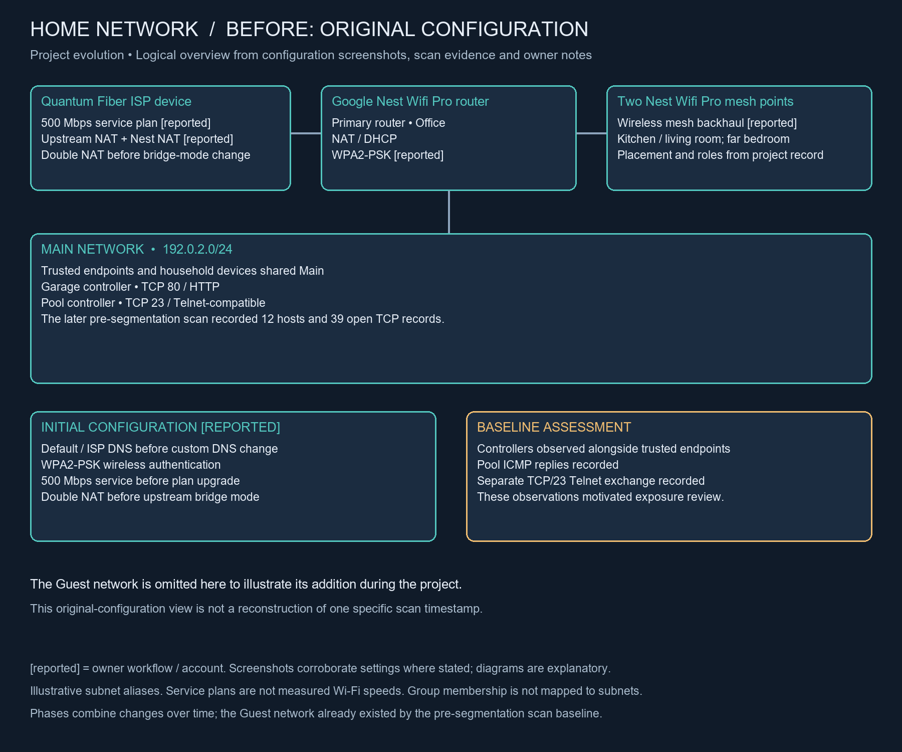
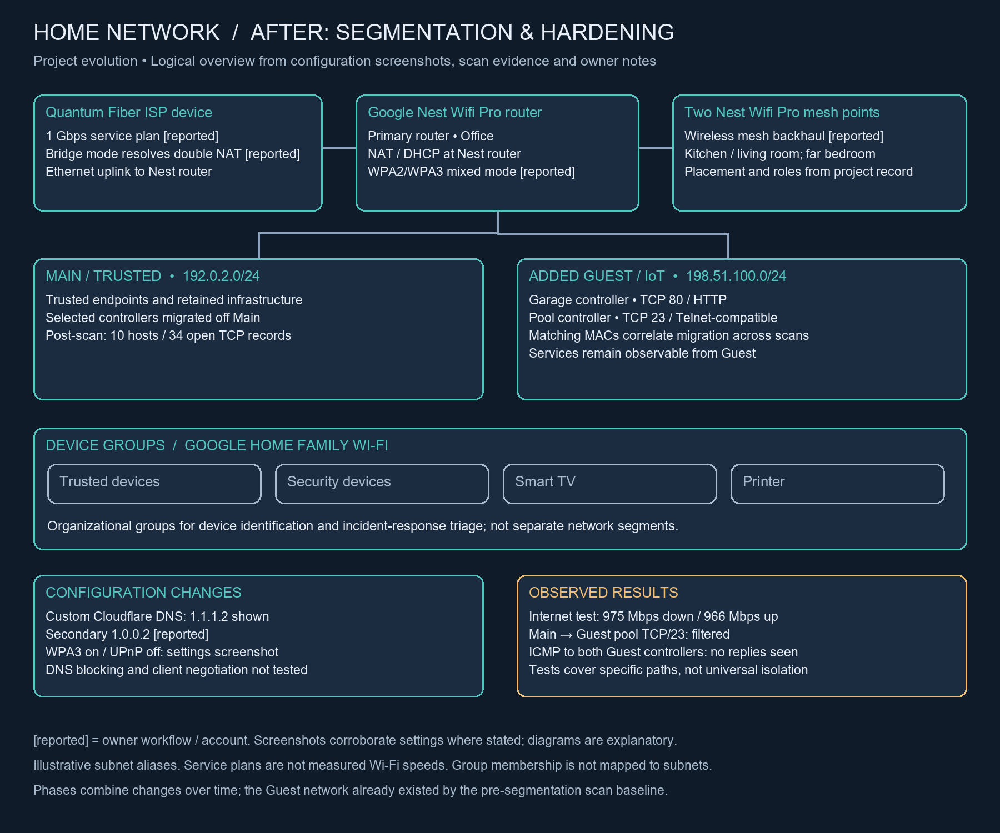

<!-- Public derivative: identifiers are pseudonymized; see documentation/publication-sanitization.md. -->
# Network Architecture

Project context identifies Internet → ISP gateway → Google/Nest router infrastructure, with a trusted Main network and a Guest/IoT network.

| Segment | Subnet | Gateway | Relevant evidence |
|---|---|---|---|
| Main / trusted | 192.0.2.0/24 | 192.0.2.1 | [Initial discovery](../evidence/04-nmap/01-initial-main-lan-discovery.png), [later Main discovery](../evidence/04-nmap/08-post-segmentation-main-lan-discovery.png) |
| Guest / IoT | 198.51.100.0/24 | 198.51.100.1 | [Guest baseline](../evidence/04-nmap/07-guest-network-initial-discovery.png), [later Guest discovery](../evidence/04-nmap/09-post-segmentation-guest-iot-discovery.png) |

Initially, Garage Door Controller IoT (192.0.2.22) and Pool Controller IoT (192.0.2.27) appeared alongside trusted endpoints. Following the reported migration, matching names appear on Guest at 198.51.100.21 and 198.51.100.22, respectively. Trusted endpoints remain on Main; workstation addresses vary between observations.

The Guest boundary is intended to restrict interaction between selected IoT systems and trusted endpoints. The Nmap targeted test shows filtered Main-to-Guest TCP/23. [Wireshark pre-segmentation ICMP](../evidence/05-wireshark/05-pre-segmentation-icmp-request-reply.png) shows pool-controller replies on Main; [post-segmentation ICMP](../evidence/05-wireshark/08-post-segmentation-main-to-guest-icmp.png) shows requests to both Guest devices without observed replies. These separate observations do not establish the full router policy, VLAN implementation, or bidirectional isolation. See [validation](../documentation/remediation-validation.md).

The following diagrams summarize the original and final project configurations using illustrative subnet aliases. They combine changes made over time rather than reconstructing two scan timestamps: Guest is omitted from the original view to show its addition, although it already existed by the pre-segmentation scan baseline. The 500 Mbps and 1 Gbps labels are reported service plans; double-NAT remediation and WPA2/WPA3 mixed mode are owner-reported. The final settings screenshot corroborates WPA3 enabled and UPnP disabled. Device groups support identification and incident-response triage; they are organizational categories, not separate network segments. These are explanatory diagrams, not captured test evidence or complete firewall policies.

### Original configuration

### Final configuration

## Deployment and operational context

The [original workflow notes](../documentation/project-workflow.md) describe a primary router in the office connected to the Quantum Fiber ISP device and two wireless mesh nodes covering the kitchen/living room and far bedroom. The plan upgrade was from 500 Mbps toward 1 Gbps; the later [Google Home result](../evidence/01-deployment/06-network-speed-validation.png) displays 975/966 Mbps download/upload on September 9, without establishing room-by-room client throughput. The notes report WPA2/WPA3 operation, DNS changes and continued phone-app cloud operation after IoT migration.

[XML verification](../documentation/python-xml-validation.md) now correlates both IoT devices by MAC across Main and Guest and confirms their respective TCP/80 and TCP/23 services remain open from the Guest scan vantage. This is segmentation of access, not removal of those services.

## Wireless configuration evidence

The [wireless screenshots](../evidence/03-wifite/README.md) show the assessment and the initial WPA3 confirmation prompt, with UPnP enabled in that earlier view. The [later advanced settings screenshot](../evidence/02-hardening/04-wpa3-upnp-off-advanced-settings.png) shows WPA3 enabled and UPnP disabled at capture time. WPA2/WPA3 mixed-mode operation remains workflow-reported; per-client negotiation, active mappings and post-change effectiveness are not established by these settings views.

## Installation and placement detail

[The deployment account](../documentation/deployment-and-hardening.md) records the primary office router's Cat 6 uplink to the Quantum Fiber ISP device, two wireless mesh nodes in the kitchen/living room and far bedroom, and the rationale for covering work, common and distant areas. The notes report app mesh checks and household connectivity tests. [Google Home device modes](../evidence/01-deployment/04-mesh-device-modes.png) show the office router in NAT (standard) mode and both mesh points in Bridge mode, automatically selected by the app. [LAN settings](../evidence/01-deployment/03-main-lan-configuration.png) show a /24 mask and DHCP pool 192.0.2.20–192.0.2.250. Upstream ISP mode and Guest sharing exceptions remain unverified. Family Wi-Fi groups are device-management categories, not additional network segments.
